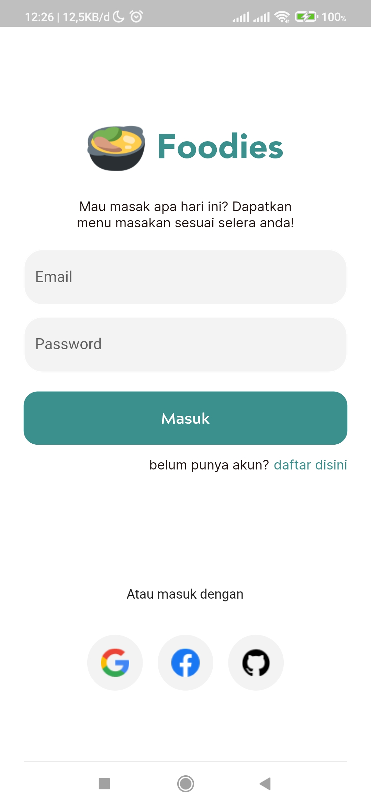
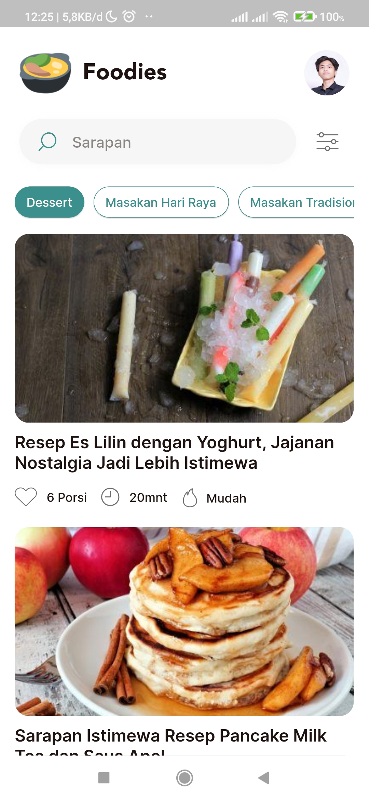
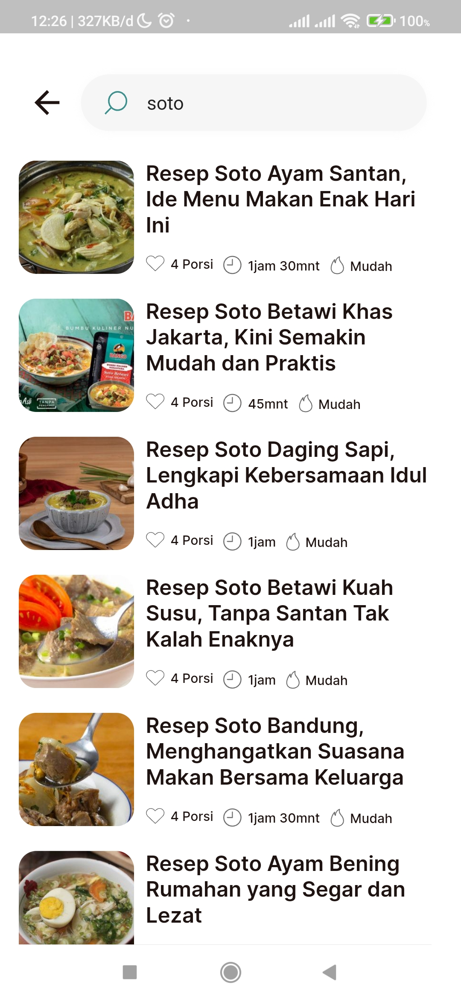
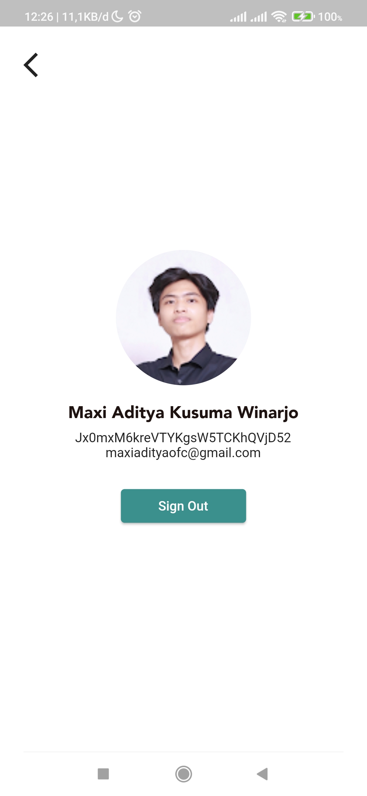

## Foodies

An app to find Indonesian recipes

## Development Setup

Clone the repository and run the following commands:

```
flutter pub get
flutter run --no-sound-null-safety
```

## Screenshots

<p float="left">
  
  
  
  
</p>

## Packages

- [http](https://pub.dev/packages/http)
- [flutter_svg](https://pub.dev/packages/flutter_svg)
- [firebase_core](https://pub.dev/packages/firebase_core)
- [firebase_auth](https://pub.dev/packages/firebase_auth)
- [google_sign_in](https://pub.dev/packages/google_sign_in)
- [github_sign_in](https://pub.dev/packages/github_sign_in)
- [flutter_facebook_auth](https://pub.dev/packages/cupertino_icons)
- [cached_network_image](https://pub.dev/packages/cached_network_image)

## Credits

Design Credit: [Viola Luna](https://www.uplabs.com/posts/the-cook-book-recipe-app)\
Backend API Creator Credit: [Ekik A](https://github.com/tomorisakura)
